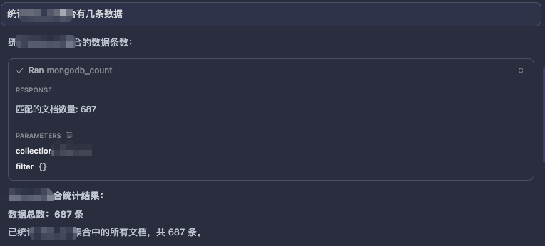

# <div align="center">db-mcp</div>

<div align="center">
  <a href="./README.md">中文</a> | <strong>English</strong>
</div>

<br />

<div align="center">
  <strong>Safely connect AI to your MySQL, Redis, and MongoDB</strong>
</div>

<div align="center">
  A <code>Model Context Protocol</code> database MCP server with preconfigured connections, runtime guardrails, connection observability, and tiered security modes.
</div>

<br />

<div align="center">
  
  
  
  
</div>

<br />

## Why This Exists

LLMs are good at querying data, summarizing results, and explaining what they find. The problem is that directly exposing a database to an AI agent usually creates a few predictable risks:

- You do not want to pass credentials to the model again and again
- Large result sets can blow up both context windows and the server itself
- Write operations need explicit boundaries instead of full access by default
- When a connection drops, a pool is saturated, or requests start queueing, the caller often cannot see it

`db-mcp` is built to make database access for AI workflows more stable, more observable, and more operationally safe.

## Highlights

| Capability | Description |
| --- | --- |
| Multi-DB | Supports `MySQL`, `Redis`, and `MongoDB` |
| Safer by default | Defaults to `read_only` to reduce accidental writes |
| Runtime guardrails | Timeouts, response truncation, concurrency limits, Mongo limits, MySQL `SQL_SELECT_LIMIT` |
| Connection awareness | Preconfigured connections, manual connect, real-time health checks |
| Ops visibility | Inspect connection status, queue depth, and pool summaries |
| MCP-ready | Standard MCP server for Cursor, Claude Desktop, and other MCP clients |

## Preview

| Redis | MySQL | MongoDB |
| --- | --- | --- |
|  |  |  |

## Quick Start

### 1. Install

```bash
git clone git@github_pig:wannanbigpig/db-mcp.git
cd db-mcp
npm install
npm run build
```

Requirements:

- `Node.js >= 18`
- `npm >= 9`

### 2. Run

```bash
npm run dev
```

or:

```bash
node dist/index.js
```

If stderr prints `db-mcp 服务器已启动`, the server is up. The startup log is currently emitted in Chinese because MCP traffic itself uses stdio.

### 3. Optional Config

```bash
cp config.json.example config.json
```

Edit `config.json` with your database settings. In most real setups, preconfigured connections are preferable to sending database passwords through tool arguments.

By default, the server loads `./config.json`. You can point it to another file with `DB_MCP_CONFIG_PATH`.

## MCP Client Setup

`db-mcp` is a standard MCP server and can be used from clients such as:

- `Cursor`
- `Claude Desktop`
- other MCP-compatible tools

### Cursor

```json
{
  "mcpServers": {
    "db-mcp": {
      "command": "node",
      "args": ["/path/to/db-mcp/dist/index.js"],
      "env": {
        "DB_MCP_SECURITY_MODE": "read_only",
        "DB_MCP_CONFIG_PATH": "/path/to/config.json"
      }
    }
  }
}
```

### Claude Desktop

```json
{
  "mcpServers": {
    "db-mcp": {
      "command": "node",
      "args": ["/path/to/db-mcp/dist/index.js"],
      "env": {
        "DB_MCP_SECURITY_MODE": "read_only"
      }
    }
  }
}
```

Replace `/path/to/db-mcp/dist/index.js` with your actual path.

## Core Ideas

### Prefer Preconfigured Connections

The server can auto-connect from `config.json` or environment variables on startup. That means the AI calling MCP tools does not need direct access to database credentials.

Common environment variables include:

- `MYSQL_HOST`
- `MYSQL_USER`
- `MYSQL_PASSWORD`
- `REDIS_HOST`
- `REDIS_URL`
- `MONGODB_URL`

### Runtime Guardrails Matter

These settings prevent slow queries, oversized responses, and sudden concurrency spikes from overwhelming the server:

- `DB_MCP_OPERATION_TIMEOUT_MS`
- `DB_MCP_MAX_RESULT_ITEMS`
- `DB_MCP_MAX_RESPONSE_BYTES`
- `DB_MCP_DEFAULT_MONGO_LIMIT`
- `DB_MCP_MAX_MONGO_LIMIT`
- `DB_MCP_MYSQL_SELECT_LIMIT`
- `DB_MCP_MAX_CONCURRENT_MYSQL`
- `DB_MCP_MAX_CONCURRENT_REDIS`
- `DB_MCP_MAX_CONCURRENT_MONGO`

### Connection State Should Be Observable

You can inspect:

- whether a database is configured
- whether the current connection is still healthy
- MySQL pool summaries
- active and queued requests per tool family

## Security Modes

Set the mode through `DB_MCP_SECURITY_MODE` or the `set_security_mode` tool.

| Mode | Positioning | Typical Use |
| --- | --- | --- |
| `read_only` | default read-only mode | production diagnostics, safe analysis |
| `restricted` | limited writes allowed | development and routine maintenance |
| `full_access` | unrestricted mode | local dev and tightly controlled test setups |

### `read_only`

- MySQL: allows `SELECT`, `SHOW`, `DESCRIBE`, `DESC`, `EXPLAIN`
- Redis: allows `redis_get`, `redis_hget`, `redis_hgetall`, `redis_keys`
- MongoDB: allows `mongodb_find`, `mongodb_find_one`, `mongodb_count`, `mongodb_list_collections`

No data modification or schema changes are allowed.

### `restricted`

- MySQL: allows common `SELECT`, `INSERT`, and `UPDATE`
- MySQL: blocks `DROP`, `TRUNCATE`, and `ALTER TABLE`
- MySQL: `DELETE` must include `WHERE`; the structured `mysql_delete` tool is still blocked
- Redis: allows `redis_set`, blocks `redis_del`
- MongoDB: allows insert and update operations, blocks delete operations

### `full_access`

- MySQL: allows queries, writes, and schema changes
- Redis: allows all supported tools
- MongoDB: allows all supported tools

Recommendation:

- use `read_only` by default
- switch to `restricted` only when writes are actually needed
- use `full_access` only when you intentionally need high-risk operations

## Database Config

### Example `config.json`

```json
{
  "databases": {
    "mysql": {
      "host": "localhost",
      "port": 3306,
      "user": "root",
      "password": "your_password",
      "database": "mydb",
      "pool": {
        "min": 2,
        "max": 10,
        "idleTimeout": 60000
      }
    },
    "redis": {
      "host": "localhost",
      "port": 6379,
      "password": "your_password",
      "db": 0
    },
    "mongodb": {
      "url": "mongodb://localhost:27017",
      "database": "mydb"
    }
  },
  "security": {
    "mode": "read_only"
  },
  "runtime": {
    "operationTimeoutMs": 30000,
    "maxResultItems": 200,
    "maxResponseBytes": 65536,
    "defaultMongoLimit": 100,
    "maxMongoLimit": 500,
    "mysqlSelectLimit": 500,
    "maxConcurrentMySql": 4,
    "maxConcurrentRedis": 16,
    "maxConcurrentMongo": 6
  }
}
```

### Dynamic Connect

Besides preconfigured connections, you can also connect at runtime with the `*_connect` tools and disconnect with `*_disconnect`.

If you are sensitive to credential exposure, prefer preconfigured connections.

### Configuration Loading Rules

- The server looks for `config.json` in the current working directory by default.
- Set `DB_MCP_CONFIG_PATH` if you want to load a config file from another location.
- Environment variables override the same values from the file.
- If a database is not configured at startup, you can still connect later with the matching `*_connect` tool.

## Environment Variables

### Config and Security

| Variable | Description | Default |
| --- | --- | --- |
| `DB_MCP_CONFIG_PATH` | Custom path to the JSON config file | `./config.json` |
| `DB_MCP_SECURITY_MODE` | Security mode: `read_only`, `restricted`, or `full_access` | `read_only` |

### Runtime Guardrails

| Variable | Description | Default |
| --- | --- | --- |
| `DB_MCP_OPERATION_TIMEOUT_MS` | Per-tool execution timeout in milliseconds | `30000` |
| `DB_MCP_MAX_RESULT_ITEMS` | Max array items returned before truncation | `200` |
| `DB_MCP_MAX_RESPONSE_BYTES` | Max serialized response size in bytes | `65536` |
| `DB_MCP_DEFAULT_MONGO_LIMIT` | Default MongoDB `find` limit when no limit is provided | `100` |
| `DB_MCP_MAX_MONGO_LIMIT` | Hard upper bound for MongoDB query limits | `500` |
| `DB_MCP_MYSQL_SELECT_LIMIT` | Max rows appended to MySQL `SELECT` queries | `500` |
| `DB_MCP_MAX_CONCURRENT_MYSQL` | Max concurrent MySQL tool calls | `4` |
| `DB_MCP_MAX_CONCURRENT_REDIS` | Max concurrent Redis tool calls | `16` |
| `DB_MCP_MAX_CONCURRENT_MONGO` | Max concurrent MongoDB tool calls | `6` |

### Database Connections

| Variable | Description |
| --- | --- |
| `MYSQL_HOST` / `MYSQL_PORT` / `MYSQL_USER` / `MYSQL_PASSWORD` / `MYSQL_DATABASE` | MySQL connection settings |
| `MYSQL_POOL_MIN` / `MYSQL_POOL_MAX` / `MYSQL_POOL_IDLE_TIMEOUT` | Optional MySQL pool tuning |
| `REDIS_HOST` / `REDIS_PORT` / `REDIS_PASSWORD` / `REDIS_DB` | Redis connection settings |
| `REDIS_URL` | Redis URL; if provided, it is passed through to the Redis client |
| `MONGODB_URL` / `MONGODB_DATABASE` | MongoDB connection settings |

## Tooling Surface

### MySQL

- `mysql_connect`: connect manually; mainly for setups without a preconfigured MySQL connection or when overriding the default one
- `mysql_query`: execute SQL directly; can reuse the default preconfigured connection
- `mysql_insert`
- `mysql_update`
- `mysql_delete`
- `mysql_disconnect`
- `mysql_pool_status`
- `mysql_connection_status`

### Redis

- `redis_connect`
- `redis_get`
- `redis_set`
- `redis_keys`
- `redis_del`
- `redis_hget`
- `redis_hgetall`
- `redis_disconnect`

### MongoDB

- `mongodb_connect`
- `mongodb_find`
- `mongodb_find_one`
- `mongodb_insert_one`
- `mongodb_insert_many`
- `mongodb_update_one`
- `mongodb_delete_one`
- `mongodb_count`
- `mongodb_list_collections`
- `mongodb_disconnect`

### Runtime / Security

- `set_security_mode`
- `get_security_mode`
- `server_runtime_status`

## Practical Examples

### MySQL Query

```json
{ "sql": "SELECT * FROM users WHERE id = ?", "params": [1] }
```

### MySQL Insert

```json
{ "table": "users", "data": { "name": "John", "email": "john@example.com" } }
```

### Redis Set

```json
{ "key": "user:1", "value": "John Doe", "ttl": 3600 }
```

### Redis Key Scan

```json
{ "pattern": "user:*", "count": 100, "limit": 200 }
```

### MongoDB Find

```json
{ "collection": "users", "filter": { "age": { "$gte": 18 } }, "limit": 10 }
```

### Runtime Status

```json
{}
```

## Observability

`server_runtime_status` is useful when you need to understand:

- why a request timed out
- why results were truncated
- why requests are queued
- why the MySQL pool is saturated
- what the current guardrail thresholds are
- whether a database connection is actually still alive

It is also the first tool to call when a startup-time default connection stops working. In that case, inspect `connections.mysql`, `connections.redis`, or `connections.mongodb` before deciding whether you actually need a manual reconnect.

## Recommended Usage Pattern

- Use preconfigured connections plus `read_only` as the default posture for production analysis.
- Move to `restricted` only for controlled write workflows such as backfills or maintenance tasks.
- Use `full_access` only in local development or tightly controlled test environments.
- Prefer `server_runtime_status` over reconnecting blindly; it tells you whether the issue is connectivity, queueing, timeouts, or response limits.

## Development

```bash
npm install
npm run build
npm run dev
npm run watch
npm test
```

## FAQ

<details>
  <summary><strong>Why prefer preconfigured connections?</strong></summary>
  <br />
  Because database credentials do not need to be passed through MCP tool arguments, which is safer and more practical for long-running setups.
</details>

<details>
  <summary><strong>Can this connect to a production database?</strong></summary>
  <br />
  Yes, but <code>read_only</code> is the safe default. Pair it with sensible timeout, response truncation, and concurrency settings.
</details>

<details>
  <summary><strong>Why add runtime guardrails at all?</strong></summary>
  <br />
  Because models naturally tend to fetch more data before summarizing. Without guardrails, it is easy to trigger oversized result sets or queue too many concurrent requests.
</details>

## 💝 Support This Project

Thanks for using `db-mcp`.

If this project helps you, you can support its ongoing development and maintenance.

<a href="./docs/SPONSOR.en.md">
  
</a>

## License

MIT

## Contributing

Issues and pull requests are welcome.
