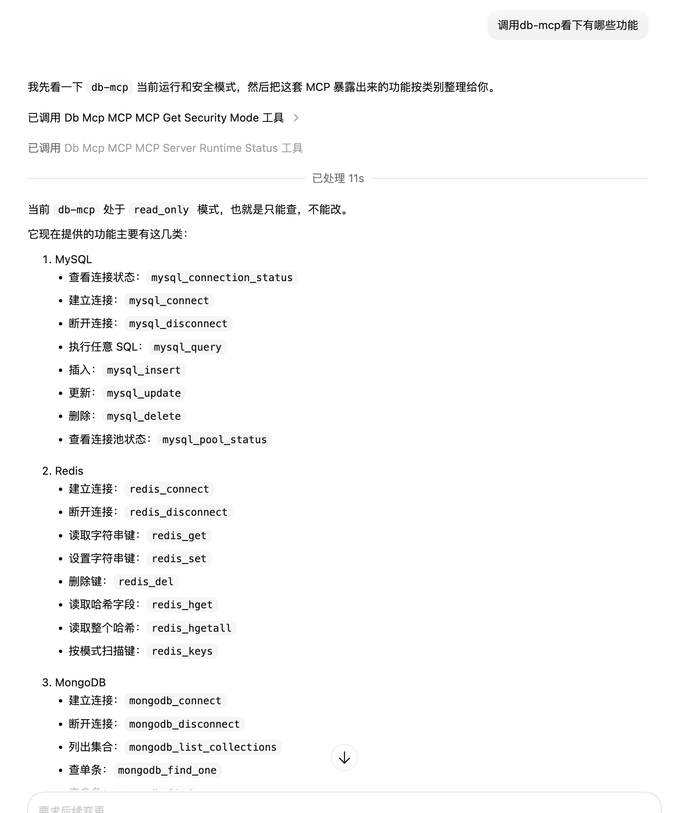
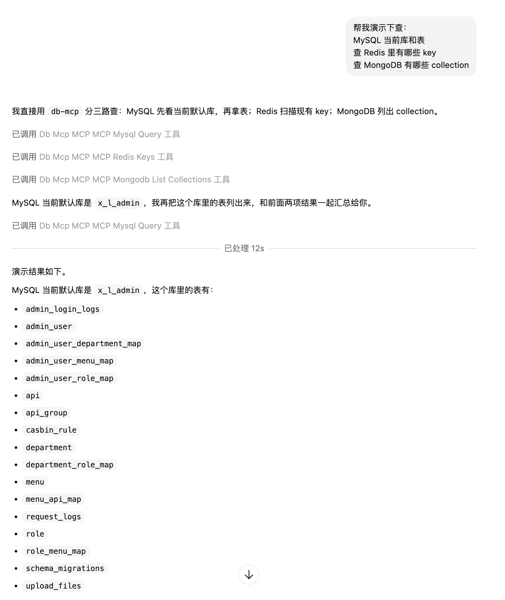

# <div align="center">db-mcp</div>

<div align="center">
  <strong>中文</strong> | <a href="./README.en.md">English</a>
</div>

<br />

<div align="center">
  <strong>让 AI 安全地连上你的 MySQL、Redis、MongoDB</strong>
</div>

<div align="center">
  一个面向 <code>Model Context Protocol</code> 的数据库 MCP Server，支持预配置连接、运行时保护、连接状态观测和分级安全模式。
</div>

<br />

<div align="center">
  
  
  
  
</div>

<br />

## 为什么做这个项目

大模型很擅长“查数据、做归纳、解释结果”，但直接把数据库完全暴露给模型，通常会遇到几个问题：

- 凭证不想反复传给模型
- 查询结果可能过大，把上下文和服务一起拖垮
- 写操作需要分级控制，不能一把梭哈
- 连接掉了、池满了、请求排队了，调用方却看不出来

`db-mcp` 的目标很明确：把数据库接入 AI 的过程做成一个更稳、更可控、也更适合放到真实工作流里的 MCP 服务。

## 核心特性

| 能力 | 说明 |
| --- | --- |
| 多数据库支持 | 同时支持 `MySQL`、`Redis`、`MongoDB` |
| 默认更安全 | 默认 `read_only`，避免模型误写库 |
| 运行时保护 | 超时、响应裁剪、并发限制、Mongo 查询 limit、MySQL `SQL_SELECT_LIMIT` |
| 连接感知 | 支持预配置连接、手动连接、实时连接健康检查 |
| 运维可观测 | 可直接查看连接状态、并发排队、连接池摘要 |
| 可接入 MCP 客户端 | 标准 MCP Server，可接入 Cursor、Claude Desktop 等客户端 |

## 示例预览

<table>
  <tr>
    <td width="50%">
      
    </td>
    <td width="50%">
      
    </td>
  </tr>
</table>

## 快速开始

### 1. 安装

```bash
git clone git@github_pig:wannanbigpig/db-mcp.git
cd db-mcp
npm install
npm run build
```

要求：

- `Node.js >= 18`
- `npm >= 9`

### 2. 运行

```bash
npm run dev
```

或：

```bash
node dist/index.js
```

如果终端输出 `db-mcp 服务器已启动`，说明服务已正常启动。

### 3. 可选配置

```bash
cp config.json.example config.json
```

编辑 `config.json`，填入你的数据库连接信息。推荐优先使用预配置连接，而不是把数据库密码作为工具参数传给模型。

## MCP 客户端配置

`db-mcp` 是标准 MCP 服务，可接入支持 MCP 的客户端，例如：

- `Codex`
- `Cursor`
- `Claude Desktop`
- 其他兼容 MCP 的工具

### Codex

在 `~/.codex/config.toml` 中加入：

```toml
[mcp_servers.db-mcp]
command = "node"
args = ["/path/to/db-mcp/dist/index.js"]
enabled = true

[mcp_servers.db-mcp.env]
DB_MCP_SECURITY_MODE = "read_only"
DB_MCP_CONFIG_PATH = "/path/to/config.json"
DB_MCP_MAX_RESPONSE_BYTES = "65536"
DB_MCP_MYSQL_SELECT_LIMIT = "500"
```

也可以直接使用命令添加：

```bash
codex mcp add db-mcp \
  --env DB_MCP_SECURITY_MODE=read_only \
  --env DB_MCP_CONFIG_PATH=/path/to/config.json \
  --env DB_MCP_MAX_RESPONSE_BYTES=65536 \
  --env DB_MCP_MYSQL_SELECT_LIMIT=500 \
  -- node /path/to/db-mcp/dist/index.js
```

### Cursor

```json
{
  "mcpServers": {
    "db-mcp": {
      "command": "node",
      "args": ["/path/to/db-mcp/dist/index.js"],
      "env": {
        "DB_MCP_SECURITY_MODE": "read_only",
        "DB_MCP_CONFIG_PATH": "/path/to/config.json"
      }
    }
  }
}
```

### Claude Desktop

```json
{
  "mcpServers": {
    "db-mcp": {
      "command": "node",
      "args": ["/path/to/db-mcp/dist/index.js"],
      "env": {
        "DB_MCP_SECURITY_MODE": "read_only"
      }
    }
  }
}
```

把 `/path/to/db-mcp/dist/index.js` 和 `/path/to/config.json` 替换成你的真实路径即可。

## 设计理念

### 预配置连接优先

服务启动时可从 `config.json` 或环境变量自动建立数据库连接。这样调用 MCP 的 AI 不需要接触数据库密码。

支持的典型环境变量：

- `MYSQL_HOST`
- `MYSQL_USER`
- `MYSQL_PASSWORD`
- `REDIS_HOST`
- `REDIS_URL`
- `MONGODB_URL`

### 运行时保护不是装饰

以下参数用于防止 MCP 服务被慢查询、大结果集或突发并发打爆：

- `DB_MCP_OPERATION_TIMEOUT_MS`
- `DB_MCP_MAX_RESULT_ITEMS`
- `DB_MCP_MAX_RESPONSE_BYTES`
- `DB_MCP_DEFAULT_MONGO_LIMIT`
- `DB_MCP_MAX_MONGO_LIMIT`
- `DB_MCP_MYSQL_SELECT_LIMIT`
- `DB_MCP_MAX_CONCURRENT_MYSQL`
- `DB_MCP_MAX_CONCURRENT_REDIS`
- `DB_MCP_MAX_CONCURRENT_MONGO`

### 连接状态可观测

你可以通过工具直接查看：

- 当前数据库是否配置过
- 当前连接是否仍然可用
- MySQL 连接池摘要
- 各类工具的并发执行和排队情况

## 安全模式

通过环境变量 `DB_MCP_SECURITY_MODE` 或工具 `set_security_mode` 进行设置。

| 模式 | 定位 | 适用场景 |
| --- | --- | --- |
| `read_only` | 默认只读 | 生产排查、只读分析 |
| `restricted` | 允许部分写操作 | 开发调试、日常维护 |
| `full_access` | 完全开放 | 本地开发、受控测试环境 |

### `read_only`

- MySQL：允许 `SELECT`、`SHOW`、`DESCRIBE`、`DESC`、`EXPLAIN`
- Redis：允许 `redis_get`、`redis_hget`、`redis_hgetall`、`redis_keys`
- MongoDB：允许 `mongodb_find`、`mongodb_find_one`、`mongodb_count`、`mongodb_list_collections`

禁止任何数据修改和结构变更。

### `restricted`

- MySQL：允许常见 `SELECT`、`INSERT`、`UPDATE`
- MySQL：禁止 `DROP`、`TRUNCATE`、`ALTER TABLE`
- MySQL：`DELETE` 必须带 `WHERE`，结构化工具 `mysql_delete` 仍会被禁止
- Redis：允许 `redis_set`，禁止 `redis_del`
- MongoDB：允许插入和更新，禁止删除

### `full_access`

- MySQL：允许查询、写入和结构变更
- Redis：允许所有已提供工具
- MongoDB：允许所有已提供工具

建议：

- 默认使用 `read_only`
- 只在确实需要写数据时切到 `restricted`
- 只有明确知道要执行高风险操作时，才使用 `full_access`

## 数据库配置

### `config.json` 示例

```json
{
  "databases": {
    "mysql": {
      "host": "localhost",
      "port": 3306,
      "user": "root",
      "password": "your_password",
      "database": "mydb",
      "pool": {
        "min": 2,
        "max": 10,
        "idleTimeout": 60000
      }
    },
    "redis": {
      "host": "localhost",
      "port": 6379,
      "password": "your_password",
      "db": 0
    },
    "mongodb": {
      "url": "mongodb://localhost:27017",
      "database": "mydb"
    }
  },
  "security": {
    "mode": "read_only"
  }
}
```

### 动态连接

除了预配置连接，也支持使用 `*_connect` 工具在运行时手动连接，使用 `*_disconnect` 断开。

如果你担心凭证暴露给模型，优先使用预配置连接。

## 工具一览

### MySQL

- `mysql_connect`: 手动连接 MySQL；仅在未预配置连接或需要覆盖默认连接时使用
- `mysql_query`: 执行 SQL；已预配置连接时可直接使用
- `mysql_insert`
- `mysql_update`
- `mysql_delete`
- `mysql_disconnect`
- `mysql_pool_status`
- `mysql_connection_status`

### Redis

- `redis_connect`
- `redis_get`
- `redis_set`
- `redis_keys`
- `redis_del`
- `redis_hget`
- `redis_hgetall`
- `redis_disconnect`

### MongoDB

- `mongodb_connect`
- `mongodb_find`
- `mongodb_find_one`
- `mongodb_insert_one`
- `mongodb_insert_many`
- `mongodb_update_one`
- `mongodb_delete_one`
- `mongodb_count`
- `mongodb_list_collections`
- `mongodb_disconnect`

### 运行时 / 安全

- `set_security_mode`
- `get_security_mode`
- `server_runtime_status`

## 工具调用示例

以下示例展示各个工具常见的调用参数格式。

### MySQL 查询

```json
{ "sql": "SELECT * FROM users WHERE id = ?", "params": [1] }
```

### MySQL 插入

```json
{ "table": "users", "data": { "name": "John", "email": "john@example.com" } }
```

### Redis 写入

```json
{ "key": "user:1", "value": "John Doe", "ttl": 3600 }
```

### Redis 键扫描

```json
{ "pattern": "user:*", "count": 100, "limit": 200 }
```

### MongoDB 查询

```json
{ "collection": "users", "filter": { "age": { "$gte": 18 } }, "limit": 10 }
```

### 运行状态

```json
{}
```

## 可观测性

`server_runtime_status` 可用于快速排查：

- 为什么请求超时
- 为什么结果被裁剪
- 为什么查询在排队
- 为什么 MySQL 连接池被打满
- 当前服务的保护阈值是多少
- 当前数据库连接是否真的还活着

## 开发

```bash
npm install
npm run build
npm run dev
npm run watch
npm test
```

## 常见问题

<details>
  <summary><strong>为什么建议优先使用预配置连接？</strong></summary>
  <br />
  因为这样数据库凭证不需要通过 MCP 工具参数传给模型，风险更低，也更适合长期运行。
</details>

<details>
  <summary><strong>这个项目适合直接连生产库吗？</strong></summary>
  <br />
  可以，但建议使用 <code>read_only</code>，并配置合理的超时、结果裁剪和并发限制。
</details>

<details>
  <summary><strong>为什么还要做运行时保护？</strong></summary>
  <br />
  因为模型天然会倾向“多查一点再总结”，没有保护的话，很容易拉出过大的结果集或积压并发请求。
</details>

## 💝 赞助项目

感谢你使用 `db-mcp`。

如果这个项目对你有帮助，欢迎赞助项目的持续开发和维护。

<a href="./docs/SPONSOR.md">
  
</a>

## 许可证

MIT

## 参与贡献

欢迎提交 Issue 和 Pull Request。
